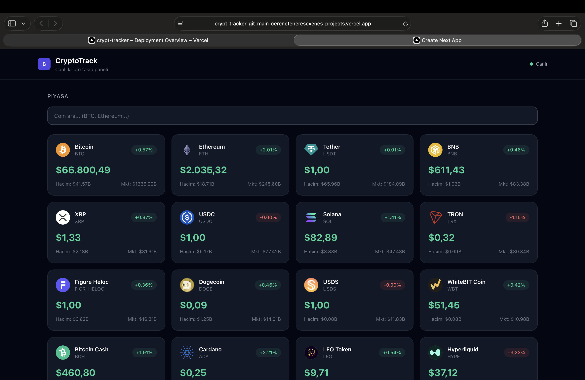

# 📈 CryptoTrack — Canlı Kripto Takip Paneli


🔴 **Canlı Demo:** [crypt-tracker-git-main-cereneteneresevenes-projects.vercel.app](https://crypt-tracker-git-main-cereneteneresevenes-projects.vercel.app)

Binance WebSocket API ile gerçek zamanlı kripto fiyat takip uygulaması.

## 📸 Ekran Görüntüleri

### Dashboard


### Portföy & Fiyat Alarmları
![Portfolio]
(screenshots/portfolio.png)
(screenshots/portfolio-alerts.png)

## ✨ Özellikler

- 📡 **Canlı fiyat akışı** — Binance WebSocket ile anlık güncelleme
- 📊 **20 coin** — Market cap sıralamasına göre CoinGecko API
- 💼 **Portföy takibi** — Coin ekle, anlık kar/zarar hesapla
- 🔔 **Fiyat alarmları** — Hedef fiyata ulaşınca tarayıcı bildirimi
- 🌙 **Dark mode** — Tam karanlık tema
- 🔍 **Arama** — Coin adı veya sembolüyle filtrele

## 🛠️ Teknolojiler

| Teknoloji | Kullanım |
|-----------|----------|
| Next.js 14 | React framework |
| TypeScript | Tip güvenliği |
| Tailwind CSS | Styling |
| Binance WebSocket | Canlı fiyat akışı |
| CoinGecko API | Coin verileri |
| Vercel | Deploy |

## 🚀 Kurulum
```bash
git clone https://github.com/cereneteneresevene/crypt--tracker.git
cd crypt--tracker
npm install
npm run dev
```

## 👩‍💻 Geliştirici

**Ceren Tanrıseven**  
[LinkedIn](https://linkedin.com/in/ceren-tanrıseven-231a711b7) · [GitHub](https://github.com/cereneteneresevene)